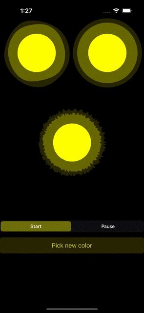

# Animated-Voice-Blob

Animated Voice Blob made like in Telegram mobile app.

---

## Swift Package Manager Support

This library is now distributed as a Swift Package.  
You can add it to your project using Xcode's **Add Package** feature or by adding the following to your `Package.swift` dependencies:

```swift
.package(url: "https://github.com/const-zz/Animated-Voice-Blob.git", from: "1.0.0")
```

Then add `"AnimatedBlob"` as a dependency for your target.

The package supports **iOS 16.0+**.

---

## Public API

### VoiceBlobView

`VoiceBlobView` is the main view for displaying animated voice blobs.

**Initialization:**
```swift
import AnimatedBlob

let voiceBlobView = VoiceBlobView(
    frame: .zero,
    maxLevel: 50,
    smallBlobRange: (0.40, 0.54),
    mediumBlobRange: (0.52, 0.87),
    bigBlobRange: (0.55, 1.00)
)
```

**Public Methods:**
- `setColor(_ color: UIColor, animated: Bool = false)`
- `updateLevel(_ level: CGFloat, immediately: Bool = false)`
- `startAnimating(immediately: Bool = false)`
- `stopAnimating(duration: Double = 0.15)`
- `updateSmallBlob(_ update: (any BlobNodeProtocol) -> Void)`
- `updateMediumBlob(_ update: (any BlobNodeProtocol) -> Void)`
- `updateBigBlob(_ update: (any BlobNodeProtocol) -> Void)`

---

### BlobNode

`BlobNode` is a building block of `VoiceBlobView`.  
You can access and configure each blob via the update methods above.

**Configurable Properties:**
- `pointsCount: Int` — More points = more detailed corners
- `isCircle: Bool` — If true, blob is a perfect circle
- `level: CGFloat` — Controls the blob's size

**Public Methods:**
- `setColor(_ color: UIColor, animated: Bool = false)`
- `updateSpeedLevel(to newSpeedLevel: CGFloat)`
- `startAnimating()`
- `stopAnimating()`

---

## Sample Usage

The sample app's main screen (`ViewController`) demonstrates usage of `VoiceBlobView` in different styles, simulates voice level changes, and includes a color picker.

<div align="center">

</div>

### Example: Animating Voice Levels

```swift
private func animate() {  
    DispatchQueue.main.asyncAfter(deadline: .now() + 0.5) { [weak self] in  
        let randomValue = CGFloat.random(in: 10...50)  
        self?.voiceBlob1.updateLevel(randomValue)  
        self?.voiceBlob2.updateLevel(randomValue)  
        self?.voiceBlob3.updateLevel(randomValue)  
        self?.animate()  
    }
}
```
Instead of random values, you can sync this with real audio levels.

---

## Customization Examples

By changing `pointsCount` and `isCircle` for each blob, you can achieve different styles:

<div align="center">


</div>

---

## Color Picker

The project includes a custom color picker to change blob colors and UI tint:

<div align="center">

</div>

